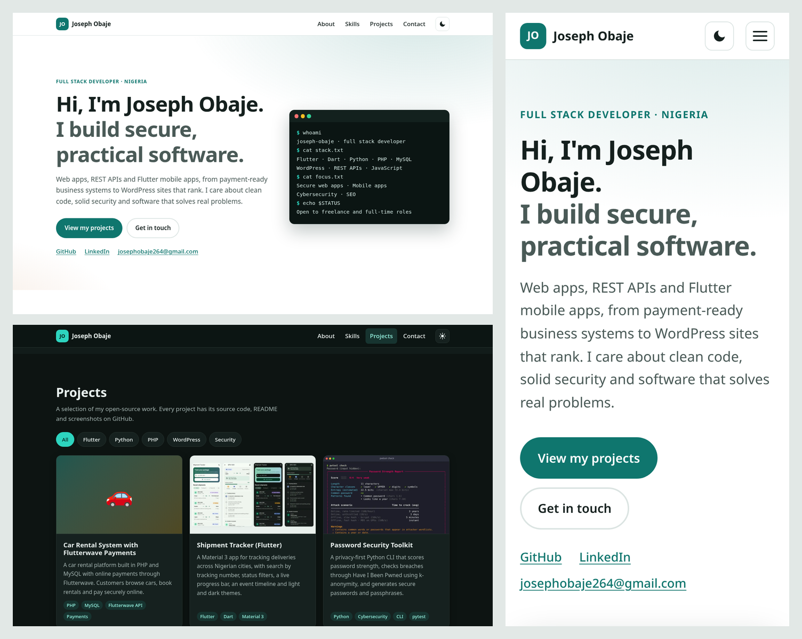

# Joseph Obaje: Developer Portfolio


My personal portfolio site: a fast, accessible single page built with plain **HTML, CSS and vanilla
JavaScript**. There is no framework and no build step. It is hosted on GitHub Pages.

**Live site:** https://josephobaje.github.io/developer-portfolio/



## Features

- **Sections**:
  - hero
  - about
  - skills (Flutter, Dart, Python, PHP, MySQL, WordPress, REST APIs, cybersecurity, SEO)
  - projects
  - contact
- **Projects grid** with 19 of my GitHub projects (Flutter apps, Laravel, PHP, Node.js and FastAPI APIs, a React dashboard, Python security, SEO and automation tools).
  - Each card has a real screenshot, a summary, tech tags and a link to the repository.
  - Filters (Flutter, Python, PHP, JavaScript, APIs, AI & Automation, WordPress, Security) use `aria-pressed` buttons and announce the result to screen readers.
- **Dark/light theme toggle**:
  - follows the OS setting by default and remembers your choice in `localStorage`
  - an inline head script applies the theme before first paint, so there is no flash
- **Contact without a backend**: direct `mailto:`, LinkedIn and GitHub links.
  - A small form validates input and opens your e-mail app with the subject and message filled in.
  - Nothing is sent to or stored by the site.
- **Accessibility**:
  - semantic landmarks and a skip link
  - visible focus styles, labelled controls and inline form errors
  - alt text on every image
  - `prefers-reduced-motion` support
  - a keyboard-friendly mobile menu that closes with Esc
- **SEO**:
  - title and meta description, canonical URL
  - Open Graph and Twitter Card tags with a 1200×630 share image
  - JSON-LD `Person` schema
  - `robots.txt` and `sitemap.xml`
- **Performance**:
  - one CSS file and two small ES modules
  - WebP thumbnails with explicit dimensions and lazy loading
  - no web fonts and no third-party scripts

## Tech stack

- HTML5, CSS3 (custom properties, grid, `color-mix()`, media queries level 4), JavaScript (ES modules)
- Dev tooling only: HTMLHint, Stylelint (`stylelint-config-standard`), ESLint 9, and Node's built-in test runner

## Project structure

```
developer-portfolio/
├── index.html              # The whole site (content is in the HTML, so it works without JS)
├── css/styles.css          # Theme variables, layout, components
├── js/
│   ├── lib.js              # Pure helpers: theme, filters, form validation, mailto builder
│   └── main.js             # DOM wiring for theme toggle, nav, filters, contact form
├── assets/img/             # Favicon, share image, project thumbnails (WebP)
├── tests/
│   ├── lib.test.js         # Unit tests for js/lib.js
│   └── site.test.js        # Static checks on index.html (links, alt text, SEO tags)
├── docs/                   # README screenshots
├── robots.txt, sitemap.xml, .nojekyll
└── package.json            # Lint/test scripts (dev dependencies only)
```

## Getting started

No build is needed. Open `index.html` directly, or serve the folder so ES modules load over HTTP:

```bash
git clone https://github.com/Josephobaje/developer-portfolio.git
cd developer-portfolio
python3 -m http.server 8000   # or: npm run serve
# open http://localhost:8000
```

### Lint and test (optional, requires Node 18+)

```bash
npm install
npm run lint   # HTMLHint + Stylelint + ESLint
npm test       # node --test: 19 tests
```

Current status: all three linters pass with no errors, and all 19 tests pass.

### Deploying

The site is published with GitHub Pages from the `main` branch, root folder. To deploy a fork:
1. Go to *Settings → Pages*.
2. Choose *Deploy from a branch*, then `main` / `/ (root)`.
3. Update the canonical URL, Open Graph URLs and `sitemap.xml` to match your Pages address.

## Roadmap

- [ ] Individual case-study pages for selected projects
- [ ] Blog section for security and SEO write-ups
- [ ] Automated Lighthouse and link checks in CI

## License

Code released under the [MIT License](LICENSE). © 2026 Joseph Obaje.
Project screenshots show my own open-source work.

## Author

**Joseph Obaje**: Full Stack Developer (Flutter · PHP · Python · WordPress · Cybersecurity · SEO)

- GitHub: [@Josephobaje](https://github.com/Josephobaje)
- LinkedIn: [joseph-obaje](https://www.linkedin.com/in/joseph-obaje)
- Email: [josephobaje264@gmail.com](mailto:josephobaje264@gmail.com)
